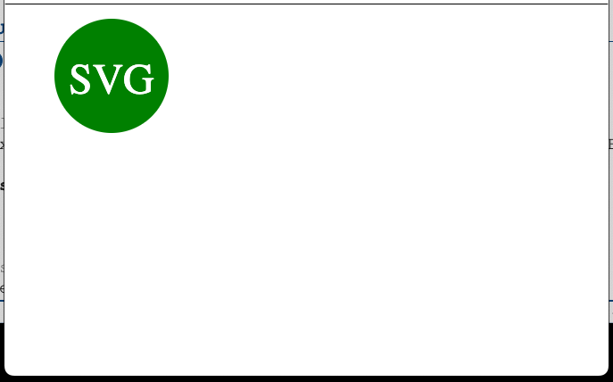

# svglogomaker
## Author: 
Mark Edwards

## Deployment:
copy to folder on local drive

## Usage

From commandline enter "node index".
Answer questions. Once completed
the logo.svg file will be created
in the examples folder.

### Screenshots
  


## User Story
```md
AS a freelance web developer
I WANT to generate a simple logo for my projects
SO THAT I don't have to pay a graphic designer
```

## Acceptance Criteria

```md
GIVEN a command-line application that accepts user input
WHEN I am prompted for text
THEN I can enter up to three characters
WHEN I am prompted for the text color
THEN I can enter a color keyword (OR a hexadecimal number)
WHEN I am prompted for a shape
THEN I am presented with a list of shapes to choose from: circle, triangle, and square
WHEN I am prompted for the shape's color
THEN I can enter a color keyword (OR a hexadecimal number)
WHEN I have entered input for all the prompts
THEN an SVG file is created named `logo.svg`
AND the output text "Generated logo.svg" is printed in the command line
WHEN I open the `logo.svg` file in a browser
THEN I am shown a 300x200 pixel image that matches the criteria I entered
```

#### Technology used:
* node.js
* inquirer
* jest
* file library
* SVG
* npm

#### Project Files:
* [Link to Video](https://github.com/mark-227-g/svglogomaker/blob/main/video/)
* [Link to sample SVG file](https://github.com/mark-227-g/svglogomaker/blob/main/examples/logo.svg)

#### References:
 * [node.js documentation](https://nodejs.org/dist/latest-v19.x/docs/api/)
 * [npm documentation](https://docs.npmjs.com)
 * [inquire documentation](https://www.npmjs.com/package/inquirer)
 * [SVG documentation](https://developer.mozilla.org/en-US/docs/Web/SVG/Element)